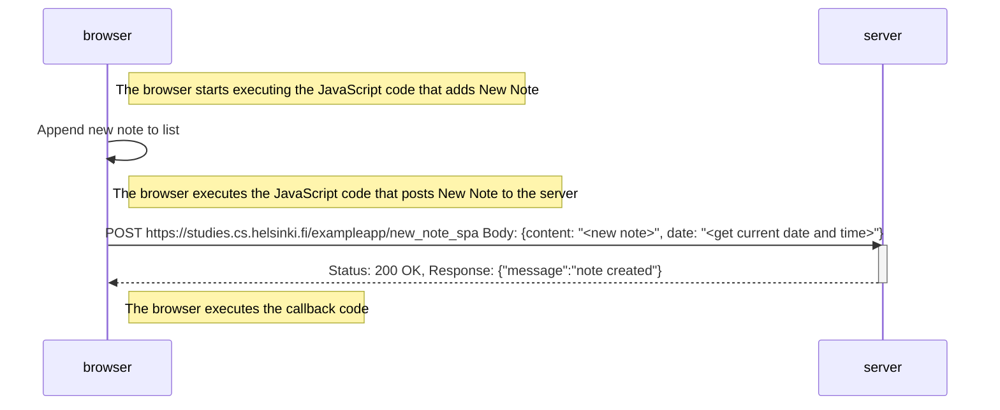

# How adding a new note works in the [SPA Note App](https://studies.cs.helsinki.fi/exampleapp/spa)

```mermaid
sequenceDiagram
    participant browser
    participant server

    Note right of browser: The browser starts executing the JavaScript code that adds New Note

    browser->>browser: Append new note to list

    Note right of browser: The browser executes the JavaScript code that posts New Note to the server

    browser->>server: POST https://studies.cs.helsinki.fi/exampleapp/new_note_spa Body: {content: "<new note>", date: "<get current date and time>"} 
    activate server
    server-->>browser: Status: 200 OK, Response: {"message":"note created"}
    deactivate server

    Note right of browser: The browser executes the callback code
```
